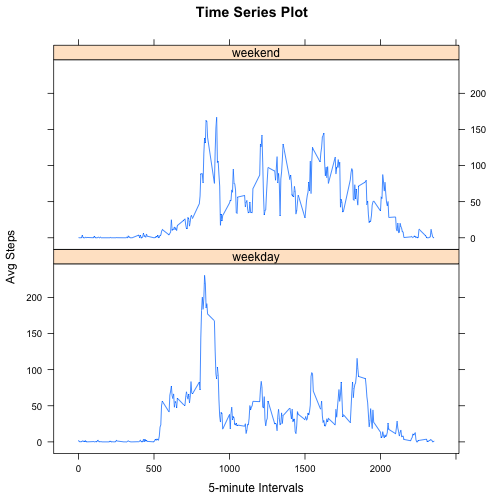

_Intro and Data Source from Course assignment description_

##Introduction
This assignment makes use of data from a personal activity monitoring device. This device collects data at 5 minute intervals through out the day. The data consists of two months of data from an anonymous individual collected during the months of October and November, 2012 and include the number of steps taken in 5 minute intervals each day.

##Data Source
**Dataset** Available here: [https://d396qusza40orc.cloudfront.net/repdata%2Fdata%2Factivity.zip](https://d396qusza40orc.cloudfront.net/repdata%2Fdata%2Factivity.zip)

**Fileformat** CSV

17,568 observations

**Variables:**

* _steps_: Number of steps taking in a 5-minute interval (missing values are coded as NA)

* _date_: The date on which the measurement was taken in YYYY-MM-DD format

* _interval_: Identifier for the 5-minute interval in which measurement was taken


##Loading and preprocessing the data

```r
activity <- read.csv("./activity.csv")
summary(activity)
```

```
##      steps               date          interval   
##  Min.   :  0.0   2012-10-01:  288   Min.   :   0  
##  1st Qu.:  0.0   2012-10-02:  288   1st Qu.: 589  
##  Median :  0.0   2012-10-03:  288   Median :1178  
##  Mean   : 37.4   2012-10-04:  288   Mean   :1178  
##  3rd Qu.: 12.0   2012-10-05:  288   3rd Qu.:1766  
##  Max.   :806.0   2012-10-06:  288   Max.   :2355  
##  NA's   :2304    (Other)   :15840
```

##Total Number of Steps Taken Per Day

###Histogram of total number of steps taken per day

```r
hist(tapply(activity$steps,activity$date,sum), main = paste("Histogram of Total Number of Steps Taken per Day"), xlab="Sum of Steps")
```

 


###Calculate mean and median total number of steps taken per day

```r
meanSteps <- mean(tapply(activity$steps,activity$date,sum), na.rm=TRUE)
medianSteps <- median(tapply(activity$steps,activity$date,sum), na.rm=TRUE)
print(paste0("Mean total number of steps taken per day is: ", meanSteps), digits = 2)
```

```
## [1] "Mean total number of steps taken per day is: 10766.1886792453"
```

```r
print(paste0("Median total number of steps taken per day is: ", medianSteps))
```

```
## [1] "Median total number of steps taken per day is: 10765"
```

##Average daily activity pattern

###Time Series Plot, Interval with Max number of steps

```r
avgStepsInt <- tapply(activity$steps,activity$interval,mean, na.rm=TRUE)
plot(names(avgStepsInt), avgStepsInt, type="l", main = "Time Series Plot", xlab="5-minute Intervals", ylab="Avg Steps")
```

 

```r
## which.max gives index number of the max 5-minute value, so to get the
## max value - which is a lable, make the label a numeric

print(paste0("Interval ", as.numeric(names(which.max(avgStepsInt))) , " contains the maximum number of steps."))
```

```
## [1] "Interval 835 contains the maximum number of steps."
```

##Imputing Missing Values

Calculate and report the total number of missing values in the dataset


```r
print(paste0("There are ", sum(is.na(activity)) , " missing values in the dataset."))
```

```
## [1] "There are 2304 missing values in the dataset."
```

###Strategy for filling in missing values in the dataset

My initial strategy was to 

* calculate the mean number of steps per day
* calucalte the mean number of steps per time interval
* take the average of the above 2 means

But after taking the mean number of steps per day, I realized that there are days with NA which could not be averaged with the mean of the interval. So my final strategy was:

* calculate the mean number of steps per time interval

###Create a new dataset
Using the above strategy replace the missing values in the activity dataset with the new mean


```r
## make a copy of activity so to change the copy and not the original
activityNoNA <- activity

meanInterval <-tapply(activity$steps, activity$interval,mean, na.rm=TRUE)

## create an index of NAs and loop through the index in the activityNoNA file
## replacing NAs with the mean for that interval

for (i in which(is.na(activityNoNA)))
    {
    activityNoNA[i,1] <- meanInterval[((i-1)%%288)+1]
    }

##new dataset is activityNoNA
```

###Historgram with new Dataset

```r
hist(tapply(activityNoNA$steps,activityNoNA$date,sum), main = paste("Histogram of Total Number of Steps Taken per Day"), xlab="Sum of Steps")
```

 


###Calculate mean and median total number of steps taken per day

```r
meanSteps <- mean(tapply(activityNoNA$steps,activityNoNA$date,sum), na.rm=TRUE)
medianSteps <- median(tapply(activityNoNA$steps,activityNoNA$date,sum), na.rm=TRUE)
print(paste0("Mean total number of steps taken per day is: ", meanSteps), digits = 2)
```

```
## [1] "Mean total number of steps taken per day is: 10766.1886792453"
```

```r
print(paste0("Median total number of steps taken per day is: ", medianSteps))
```

```
## [1] "Median total number of steps taken per day is: 10766.1886792453"
```

The value for mean in my new file is the same in as the original file. The median for my new file is now the same as the mean. 

Imputing missing data for missing data increased the number of steps taken per day. 

##Difference in Activity Patterns Between Weeekdays and Weekends?

For this analysis the dataset with NAs replaced will be used, activityNoNA

###Adding new variable for weekend/weekday

Add a new column to the new activity file specifying the day of the week.
Then the data will be plotted as a panel plot containing a time series plot (i.e. type = "l") of the 5-minute interval (x-axis) and the average number of steps taken, averaged across all weekday days or weekend days (y-axis).


```r
weekend <- c("Sunday","Saturday")

dayWeek <- c()

## Check for day of week as a weekend, if not, it's a weekday
for (i in 1:length(activityNoNA$steps))
    {
    if (any(weekdays(as.Date(activityNoNA[i,2])) == weekend)) 
        {
            ##add "weekend"" to new column for that row
            dayWeek[i] <- "weekend"  }
            ##else add "weekday"" to new column for that row
        else { dayWeek[i] <- "weekday"
         }
    }
## Combine activity file with dayweek column

    activityNoNA <- cbind(activityNoNA,dayWeek)
```

###Weekday/weekend charts
Time series plot of 5-minute interval


```r
library(lattice)

##split dataset into weekend rows and weekday rows
## change the resulting lists to dataframes

a <- split(activityNoNA, activityNoNA$dayWeek)
wkDays <- do.call(rbind.data.frame,a[1])
wkEnd <- do.call(rbind.data.frame,a[2])

    
avgStepsIntwkDay <- tapply(wkDays$steps,wkDays$interval,mean)
avgStepsIntwkEnd <- tapply(wkEnd$steps,wkEnd$interval,mean)


intPlotwd <- as.data.frame(cbind(avgStepsIntwkDay, as.numeric(as.character((names(avgStepsInt))))))
intPlotwe <- as.data.frame(cbind(avgStepsIntwkEnd, as.numeric(as.character((names(avgStepsInt))))))

df.intPlotwe <- cbind(intPlotwe, rep("weekend",288))
df.intPlotwd <- cbind(intPlotwd, rep("weekday",288))

colnames(df.intPlotwd) <- c("avgSteps", "interval","dayweek")
colnames(df.intPlotwe) <- c("avgSteps", "interval","dayweek")


intPlot <- rbind(df.intPlotwd, df.intPlotwe)


xyplot(avgSteps ~ interval | dayweek, intPlot, layout=c(1,2),
type="l",main = "Time Series Plot", xlab="5-minute Intervals", ylab="Avg Steps")
```

 

